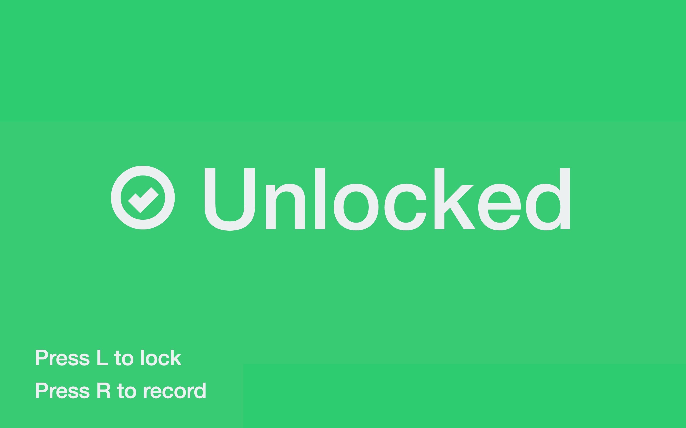

# key...

**... is a new authentication system.** 

Instead of using passcodes, it uses pass**chords**. *(groan)*

If you have a MIDI keyboard, try the code in this repository out here:

**[key.bede.io](https://key.bede.io)**

*(Hint: play the Eb above middle C three times!)*

### FAQ's:

**I can't hear anything!**

You shouldn't be able to. That's what makes it Very Secure!

*More seriously: this project used to include a mini-synthesizer. That proved to be way too hard to deal with for me, so I stripped it out and just use a soft-synth running in the background on my computer. There's plenty of good, free VST or AU instruments, and I keep Hosting AU open because of its minimal memory footprint.*

**But this isn't secure, is it?**

Nope, not right now. But it's pretty clear in `main.js` which functions would need to be changed to send data to an external API. I'm in the process of writing a suitable backend — it's using a token exchange system somewhat similar to OAuth2.

**I don't have a MIDI keyboard!**

Not much I can do, I'm afraid. At some point it'd be nice to write a QWERTY-to-piano library, but that's a big job in itself. 